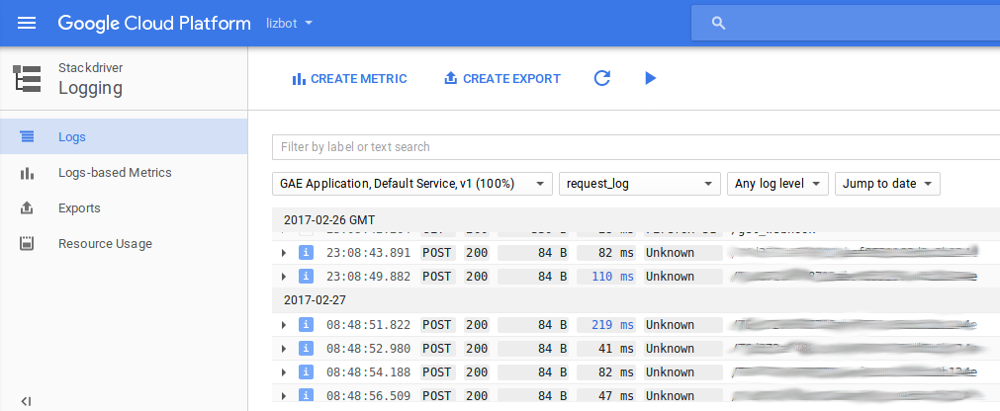
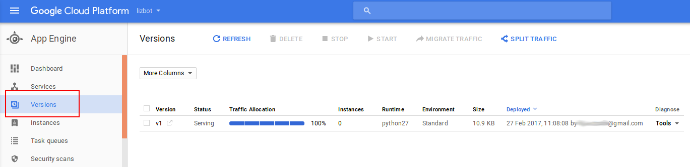

# A dummy Telegram bot to be hosted at Google Cloud

[About telegram bots in general.](https://telegram.org/blog/bot-revolution)

Following description guides for deployment of Telegram bot on [Google App Engine](https://console.cloud.google.com/appengine).

### Prerequisites ###

[Google Cloud SDK](https://cloud.google.com/sdk/downloads)
Git
Any text editor

### Steps to add your Telegram bot to Google App Engine ###

1. Sign up or login in Google Cloud and create a [new project](https://console.cloud.google.com/projectcreate).

2. Go through [App Engine wizard](https://console.cloud.google.com/appengine/start).

3. Initialize Google Cloud SDK and go through the login process:

 ```bash
$ gcloud init
```

4. Clone this repo:

 ```bash
$ git clone https://github.com/stop-cran/google-cloud-telegram-bot.git
$ cd google-cloud-telegram-bot
```
 
5. Create a new Telegram bot - speak to [@BotFather](https://t.me/BotFather). Copy an API key of the created bot.

6. Update config.ini at your repository folder - set TOKEN to the API key, HOOK_TOKEN to a random URL-friendly string, PROJECT_ID to Google Cloud project name.

7. Deploy the app:

 ```bash
$ gcloud app deploy
```

8. Open app in the browser to set a web hook: https://**Google Cloud project ID**.appspot.com/set_webhook. This should return:

 ```json
 {
   "description": "Webhook was set",
   "ok": true,
   "result": true
 }
```

9. Try to speak to your bot at https://**t.me/your Telegram bot ID**!


### Management and debugging ###
* Read **_requests logs_** from default application:

```bash
$ gcloud app logs read --service default --limit 10
```

* Stream **_requests logs_** from the command line:

```bash
$  gcloud app logs tail -s default
```

* **_Application logs_** (*including logs from Python's logging module*) are generated **per request**, and can be viewed in the console:
  * Google Cloud Platform -> Stackdriver logging -> Logs
  

  
  * You can also read the applications logs [via API](https://cloud.google.com/appengine/docs/standard/python/logs/) or by an [Android app](https://cloud.google.com/console-app)


* Manage application versions from the console:
  * List all versions:
  
```bash
$ gloud app versions list
```

  * Delete vesions:
  
```bash
$ gcloud app versions delete v1 v2
```

* Manage versions using GUI :
  * Google Cloud Platform -> App Engine -> [Versions](https://console.cloud.google.com/appengine/versions)
  



### References ###
[Google App Engine dashboard](https://console.cloud.google.com/appengine)

[Adding Cloud Source Repositories as Remote](https://cloud.google.com/source-repositories/docs/adding-repositories-as-remotes)

[Telegram Bot API](https://core.telegram.org/bots/api)
